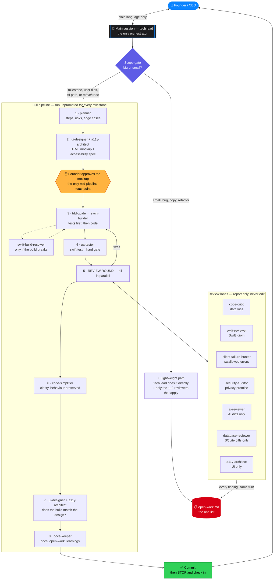
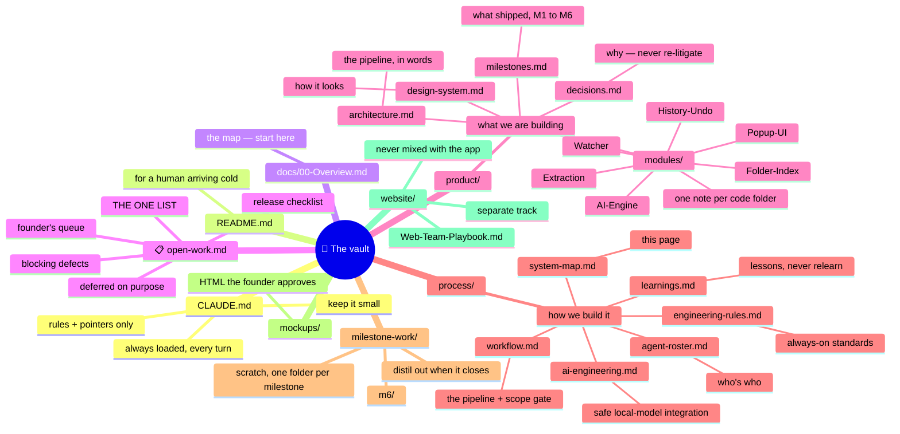
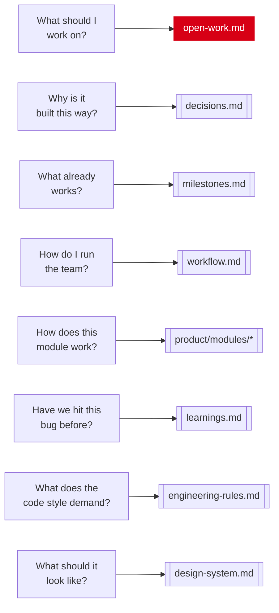
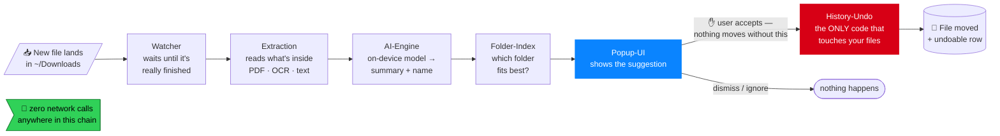
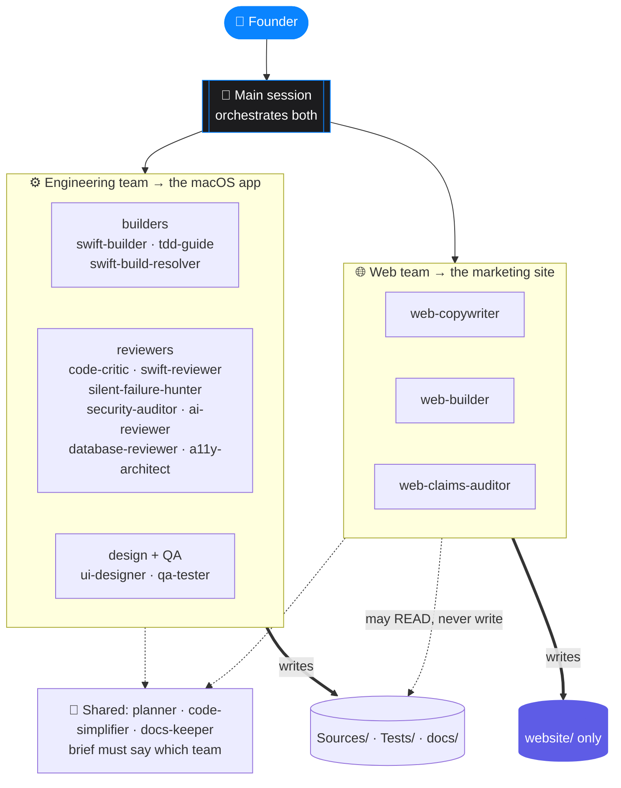
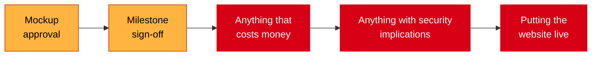

# System map

One page showing how the whole thing fits together: who does the work, what the
documents are for, and how a file travels through the app. Diagrams render in
Obsidian and on GitHub.

---

## 1. The agent workflow

The founder speaks only to the main session. The main session is tech lead, and
the only thing that can start an agent.

**Read it as:** everything funnels through the tech lead. The scope gate decides
whether a change earns the full pipeline. Reviewers can only *report* — they
cannot edit, so no judgement call gets buried. Every finding lands in
[[open-work]] the moment it arrives.

---

## 2. The documents, and what each is for

### The rule that keeps it clean

**Root of `docs/` = the map and the open list. Nothing else.** Anything tied to
one milestone goes in `docs/milestone-work/<milestone>/`, and when that milestone
closes its durable facts are **distilled out** into the permanent homes above.

> A fact that exists only in a closed milestone's scratch folder is **lost** —
> nobody reads a finished milestone's working notes.

---

## 3. Which document answers which question

---

## 4. How a file travels through the app

The code mirrors this exactly — one folder under `Sources/FileOrganizer/` per
box, one note in `docs/product/modules/` per folder.

**Three invariants** the whole product rests on:

1. **Zero network calls.** The model ships with macOS; there is nothing to
   download. Any networking is a critical review finding.
2. **Nothing moves without an explicit accept.**
3. **Only History-Undo mutates a file**, so every change is recorded and
   reversible.

---

## 5. The two teams

The boundary is enforced, not just promised: web sessions run gstack
`/freeze website/`, which physically restricts edits to that folder.

---

## 6. Founder gates — where work stops and waits

Everything currently sitting at one of these gates is in
[[open-work]] › *Waiting on the founder*.

---

**Related:** [[workflow]] · [[agent-roster]] · [[open-work]] · [[architecture]] · [[00-Overview]]
